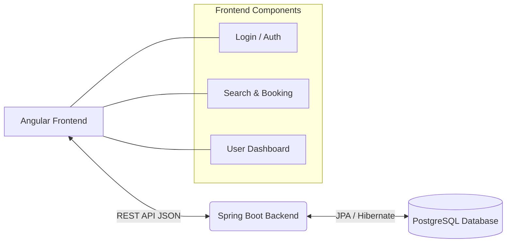

# Flight Booking System

## Executive Summary
The Flight Booking System is a comprehensive, full-stack web application designed to simplify the process of searching for and booking flights. It provides a seamless user experience with intuitive interfaces for standard users to book travel and a robust administrative portal for managing the platform.

## Key Features
- **Dynamic Search Engine:** Users can search for flights by origin, destination, and dates with immediate results.
- **Role-Based Access Control:** Distinct registration and login flows for standard users and administrators.
- **Interactive Booking Flow:** Step-by-step wizard from flight selection, to passenger details, to checkout.
- **Dual Payment Interface:** Support for both traditional Credit/Debit cards and modern UPI payment methods (with QR code scanning).
- **Booking Management:** Dedicated dashboard for users to review past bookings and cancel upcoming flights.
- **Secure Authentication:** Passwords are encrypted using BCrypt hashing before being stored in the PostgreSQL database.

## Technology Stack
- **Frontend:** Angular 19 (TypeScript, HTML, CSS), fully responsive design.
- **Backend:** Spring Boot 3 (Java), utilizing Spring Web and Spring Data JPA.
- **Database:** PostgreSQL (Relational Database) for persistent storage of users, flights, and bookings.
- **Security:** Spring Security & BCrypt Password Encoder.

## Architecture



## Setup & Running Locally

### 1. Database Setup
1. Install PostgreSQL and create a database named `FlightBookingSystem`.
2. Update the backend credentials in `src/main/resources/application.properties` to match your local Postgres username and password.

### 2. Running the Backend
1. Navigate to the `Flight_Booking_System_Backend` folder.
2. Run the Spring Boot application using Maven:
   ```bash
   .\mvnw.cmd spring-boot:run
   ```
3. The server will start on `http://localhost:8080`. (The database schema will automatically generate via Hibernate).

### 3. Running the Frontend
1. Navigate to the `Flight_Booking_System` folder.
2. Install dependencies (if not already done):
   ```bash
   npm install
   ```
3. Start the Angular development server:
   ```bash
   ng serve
   ```
4. Access the application in your browser at `http://localhost:4200`.

## Database Schema Highlights
- **Users:** Stores user profiles, emails, hashed passwords, and roles (`USER` vs `ADMIN`).
- **Flights:** Stores flight schedules, origins, destinations, prices, and available seats.
- **Bookings:** Relates users to flights, tracking payment status and total amounts.
